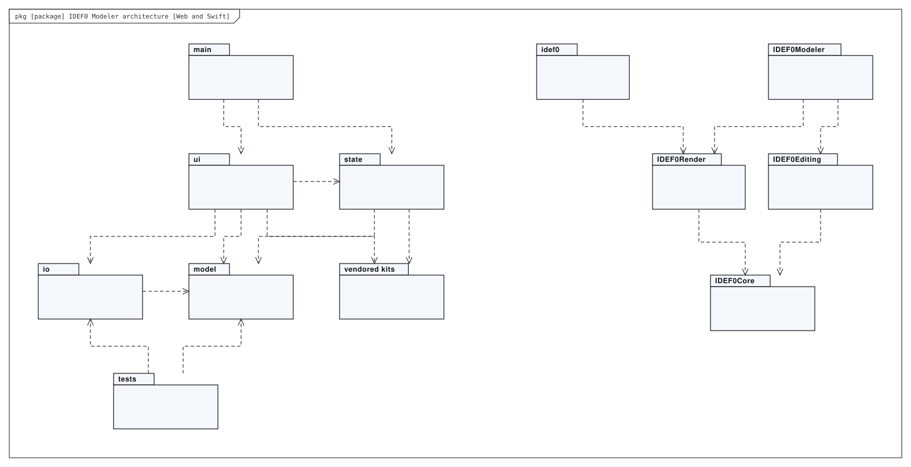
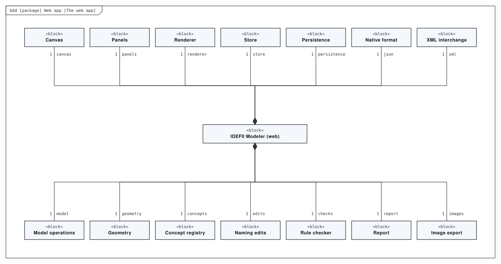
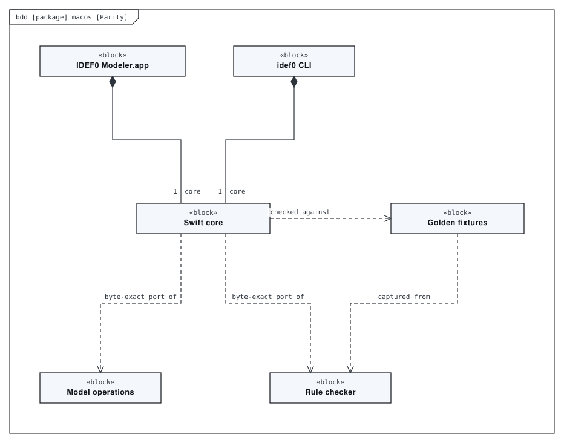
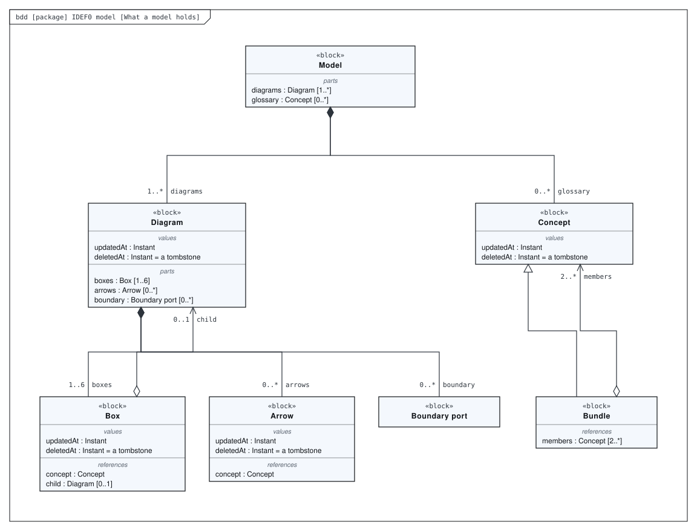
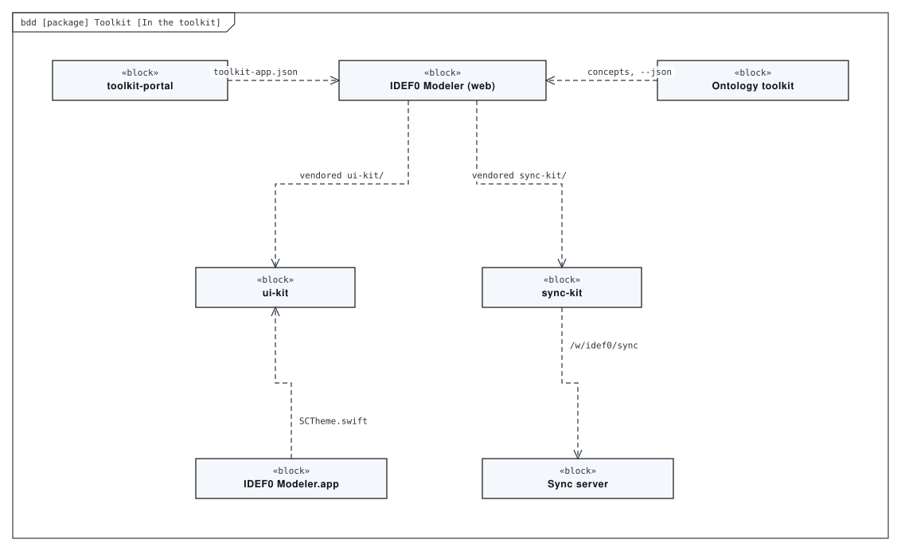
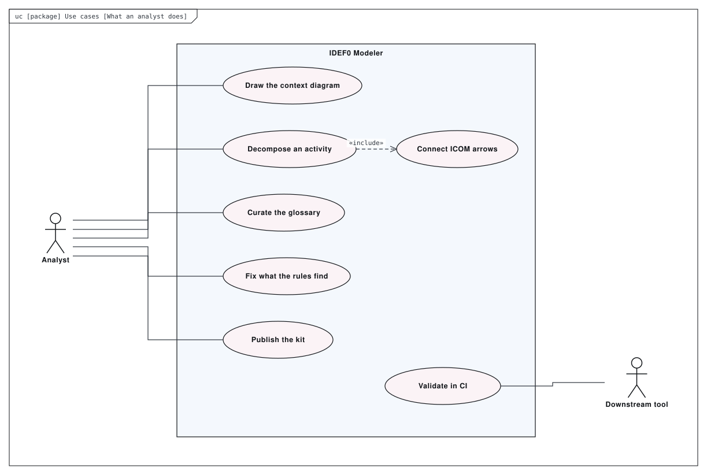
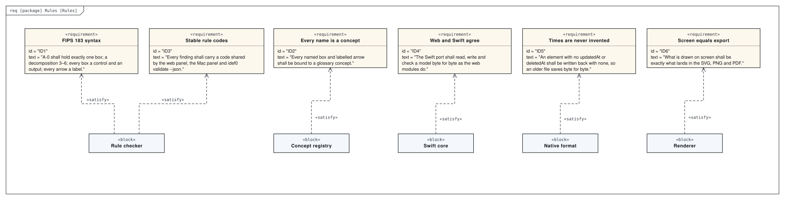

# Architecture

An editor for IDEF0 function models (FIPS PUB 183 / IEEE 1320.1): context diagrams, decompositions, ICOM arrows, tunnelling, node numbering, rule checking, and export to SVG / PNG / PDF, XML and a written report. The web app has no build step. `macos/` holds a byte-exact Swift port of `src/model` and `src/io` behind a SwiftUI app and the `idef0` CLI, held in lockstep with the web modules by golden fixtures. Every name is bound to a concept, so other tools can read the model rather than just look at it.

This directory holds a SysML model of the repository, made with [SysML Modeler](https://github.com/allenxhsu/sysml-modeler).
`architecture.sysml.json` is the source: open it with **File ▸ Open** in the modeler to edit it, and re-export the SVGs from there.
The SVGs below are exports of it. The model passes the modeler's checks with 0 errors and 0 warnings.

## Web and Swift

*Package diagram* of **IDEF0 Modeler architecture**.

## The web app

*Block definition diagram* of **Web app**. index.html and src/ — plain ES modules and SVG; no build step, no package manager, no dependencies.

## Parity

*Block definition diagram* of **macos**. A Swift package: a byte-exact port of src/model and src/io, built into a SwiftUI app and a CLI.

## What a model holds

*Block definition diagram* of **IDEF0 model**. What a *.idef0.json holds.

## In the toolkit

*Block definition diagram* of **Toolkit**.

## What an analyst does

*Use case diagram* of **Use cases**.

## Rules

*Requirement diagram* of **Rules**. What the model enforces and promises. The full rule table, 30-odd codes, is in the README.

## Generated views

Computed from the model each time it is opened in the modeler:

- **Rules, as a table** — requirement table
- **What verifies which rule** — dependency matrix
